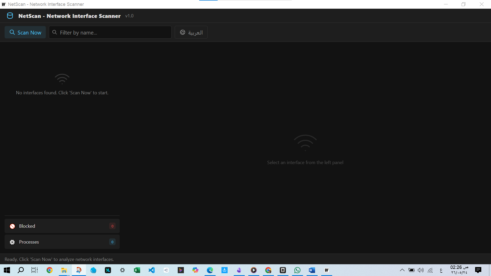
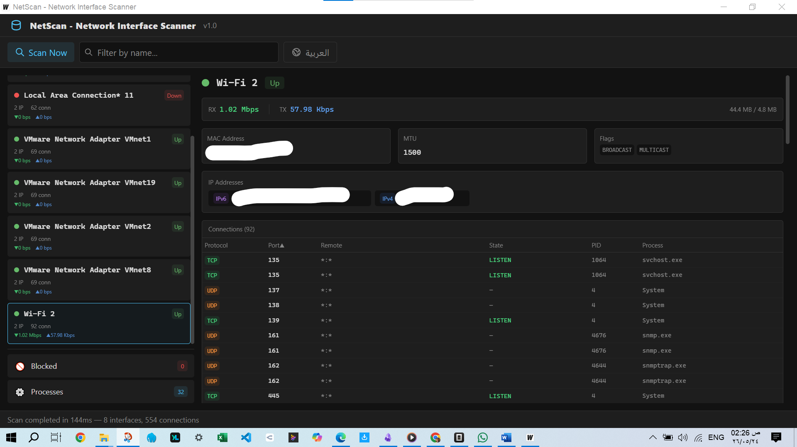

<div align="center">

# 🔍 NetScan

**Real-time Network Interface Scanner & Firewall Manager**


[](LICENSE)

---



</div>

## 📋 Overview

**NetScan** is a cross-platform desktop application that scans, analyzes, and controls network interfaces in real time. Built with Go + Vue 3, it provides instant visibility into your network stack and lets you block/unblock IPs and processes directly from the UI.

| Feature | Description |
|---------|-------------|
| 🔌 **Interface Discovery** | Enumerate all physical, virtual, and loopback interfaces |
| 🌐 **IP Intelligence** | IPv4/IPv6 addresses, MAC, MTU, flags — at a glance |
| 🔗 **Connection Mapping** | Active TCP/UDP connections with PID, process name, and state |
| 📊 **Throughput Monitor** | Live RX/TX bandwidth per interface (Kbps/Mbps/Gbps) |
| 🛡️ **Firewall Control** | Right-click to block/unblock IPs and PIDs via OS firewall |
| 🌍 **Bilingual UI** | Full English and Arabic (RTL) support |

---

## ✨ Screenshots

<div align="center">

### Before Scan — Clean, Ready State


### After Scan — Full Network Discovery



</div>

---

## ⚡ Quick Start

### Prerequisites

- **Go** 1.21+ • **Node.js** 18+ • **Wails v2 CLI**

```bash
go install github.com/wailsapp/wails/v2/cmd/wails@latest
```

### Build & Run

```bash
# Development mode (hot reload)
wails dev

# Production build
wails build -platform windows/amd64 -o NetScan.exe   # Windows
wails build -platform linux/amd64 -o netscan          # Linux
wails build -platform darwin/amd64 -o NetScan.app     # macOS Intel
wails build -platform darwin/arm64 -o NetScan.app     # macOS Apple Silicon
```

> **Note:** Cross-compilation is not supported by Wails v2. Build each platform binary natively on the target OS.

---

## 🧠 Architecture

```
┌─────────────────────────────────────────────────────────┐
│  Vue 3 + Tailwind CSS                                   │
│  ┌──────────┐ ┌──────────┐ ┌──────────┐ ┌──────────┐  │
│  │ Toolbar  │ │   Table  │ │ CtxMenu  │ │  Toasts  │  │
│  └────┬─────┘ └────┬─────┘ └────┬─────┘ └────┬─────┘  │
│       └─────────────┼────────────┼─────────────┘        │
│                ┌────▼────────────▼─────┐                 │
│                │      App.vue          │                 │
│                │  (state + events)     │                 │
│                └──────────┬───────────┘                 │
│                    Wails Bind (JS↔Go)                   │
├──────────────────────────┼──────────────────────────────┤
│  Go Backend              │                              │
│                ┌─────────▼──────────┐                    │
│                │ NetworkController  │                    │
│                └──┬──────┬──────┬───┘                    │
│          ┌────────┴┐ ┌───┴───┐ ┌┴────────┐              │
│          │ Scanner │ │Firewall│ │Throughput│              │
│          │ Service │ │Service│ │ Monitor  │              │
│          └─────────┘ └───────┘ └──────────┘              │
│                                                        │
│  Libraries:  net (stdlib) │ gopsutil │ netsh/iptables  │
└────────────────────────────────────────────────────────┘
```

---

## 🎯 Features in Detail

### 🔌 Interface Discovery
- Lists every network interface with live status (Up/Down)
- Displays IPv4/IPv6 addresses, MAC address, MTU, and flags
- Mini RX/TX throughput on each interface card

### 🔗 Connection Analysis
- Full table of active TCP/UDP connections per interface
- Sorted by protocol, port, remote address, state, PID, or process name
- Visual indicators for blocked items directly in the table

### 🛡️ Firewall Control
- **Right-click** any IP address → **Block IP**
- **Right-click** any connection → **Block PID** (blocks all traffic on that process port)
- **Blocked Items** tab lists all blocked IPs and PIDs with one-click **Unblock**
- All operations confirmed via dialog to prevent accidents

### 📊 Throughput Monitoring
- 1-second polling via `gopsutil/net.IOCounters`
- Real-time RX (▼ green) / TX (▲ blue) displayed as Kbps, Mbps, or Gbps
- Auto-scales units for readability

### 🌍 Bilingual RTL Support
- Toggle between English and Arabic at any time
- Full RTL layout when Arabic is selected
- All UI elements, dialogs, and toasts properly localized

---

## 🧪 Testing

```bash
# All backend tests
go test ./backend/ -v

# With race detection
go test ./backend/ -race -v

# Specific test
go test ./backend/ -v -run TestScanWithDefaults
```

---

## 🛡️ Security

| Concern | Mitigation |
|---------|-----------|
| Firewall operations | Executed via `os/exec` with **separated arguments** — no shell injection |
| Privilege handling | Graceful fallback with clear message instead of crash |
| Portable executable | Single binary — no runtime dependencies, no installers |

> ⚠️ **Administrator/root** privileges required for firewall operations and full connection data.

---

## 📁 Project Structure

```
MyApp/
├── main.go                    # Entry point
├── app.go                     # Wails app binding
├── wails.json                 # Build config
├── backend/
│   ├── scanner.go             # Interface + connection scanner
│   ├── firewall.go            # OS firewall integration
│   ├── throughput.go          # Bandwidth monitor
│   ├── binding.go             # Controller layer
│   └── models.go              # Data structures
├── frontend/src/
│   ├── App.vue                # Root component
│   ├── components/            # Vue UI components
│   └── i18n/                  # en.json + ar.json
├── Imge/                      # Screenshots
└── build/bin/                 # Compiled binaries
```

---

## 📄 License

This project is licensed under the **MIT License** — see the [LICENSE](LICENSE) file for details.

---

<div align="center">

**Built with ❤️ using [Wails](https://wails.io) • [Vue 3](https://vuejs.org/) • [Tailwind CSS](https://tailwindcss.com/)**

<sub>Network programming references: Woodcock, A. (2018). *Network Programming with Go*. No Starch Press.</sub>

</div>
